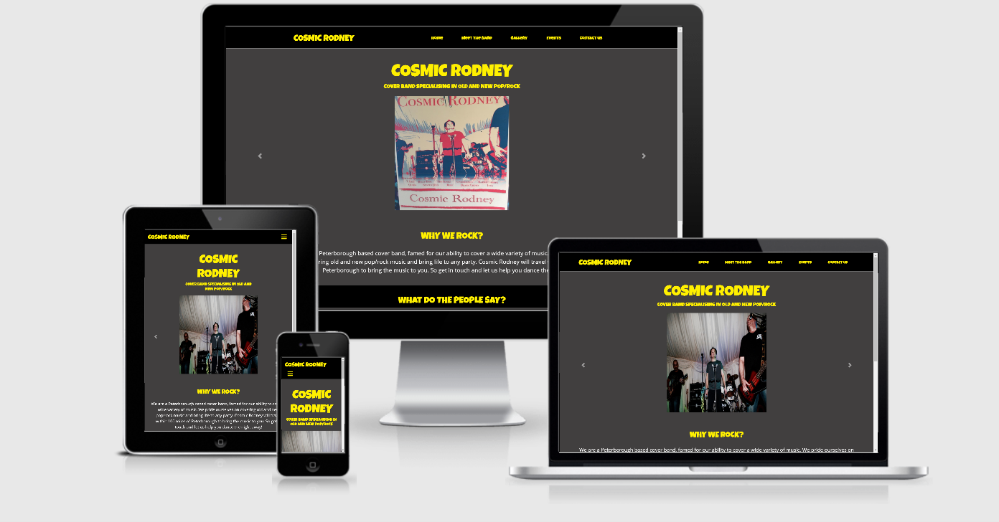
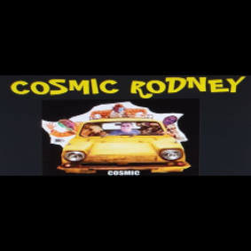

# Cosmic Rodney

A website built to help promote a cover band based in Peterborough called *Cosmic Rodney*. 
The website will contain contact information and contact options. 

Hosted on [GitHub Pages](https://leeton1412.github.io/cosmic-rodney/)
Repository on [GitHub.com](https://github.com/leeton1412/cosmic-rodney)

## License
>This project is created for the use of members of the band [Cosmic Rodney](https://en-gb.facebook.com/cosmicrodney/). 
It is not avaliable for sharing. 

## UX

### Users

The predicted users of the site will be Fans, Pub owners, Event planners and Band Agents.

### User Stories 
1. A fan of Cosmic Rodney looking for information on future events or band member information.
2. Pub owners looking to book Cosmic Rodeny for future events
3. Event planners looking to aquire entertainment for corporate or personal events.
4. Agents looking to potentially contact the band after viewing there media.

### Thoughts Behind The Design

Colors and theme of the website are based off this logo

    Yellow    
